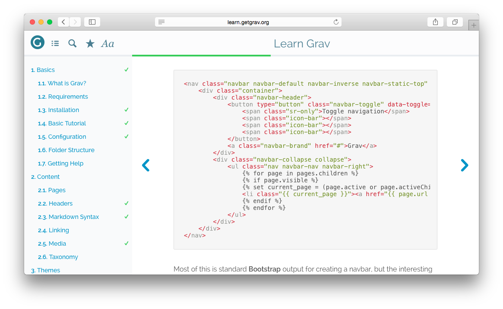

This fork was created to easily update highlight grav plug to latest highlight.js script.

# Grav Highlight Plugin



`highlight` is a [Grav](http://github.com/getgrav/grav) plugin that adds simple and powerful code highlighting functionality utilizing [Highlight.js](https://highlightjs.org/).

> Highlight.js: [plugin](https://highlightjs.org/): v11.3.1

> Highlight.js line numbers [plugin](https://github.com/wcoder/highlightjs-line-numbers.js/): v2.8.0

## Manual Installation REQUIRED

To install this plugin, just download the zip version of this repository and unzip it under `/your/site/grav/user/plugins`. Then, rename the folder to `highlight`. You can find these files either on [GitHub](https://github.com/getgrav/grav-plugin-highlight) or via [GetGrav.org](http://getgrav.org/downloads/plugins#extras).

You should now have all the plugin files under

    /your/site/grav/user/plugins/highlight

>> NOTE: This plugin is a modular component for Grav which requires [Grav](http://github.com/getgrav/grav), the [Error](https://github.com/getgrav/grav-plugin-error) and [Problems](https://github.com/getgrav/grav-plugin-problems) plugins, and a theme to be installed in order to operate.

# Usage

To best understand how Highlight works, you should read through the original project [documentation](https://highlightjs.org/usage/).

You can override any default settings from the page headers:

eg:

    ---
    title: Sample Code With Custom Theme
    highlight:
        theme: monokai
    ---

    ```
    @font-face {
      font-family: Chunkfive; src: url('Chunkfive.otf');
    }

    body, .usertext {
      color: #F0F0F0; background: #600;
      font-family: Chunkfive, sans;
    }

    @import url(print.css);
    @media print {
      a[href^=http]::after {
        content: attr(href)
      }
    }
    ```


You can also disable highlighting for a particular page if causes issues:

    ---
    title: Sample Code with Highlight disabled
    highlight:
        enabled: false
    ---

    ```
    @font-face {
      font-family: Chunkfive; src: url('Chunkfive.otf');
    }

    body, .usertext {
      color: #F0F0F0; background: #600;
      font-family: Chunkfive, sans;
    }

    @import url(print.css);
    @media print {
      a[href^=http]::after {
        content: attr(href)
      }
    }
    ```

Further, you can also enable line numbers on a specific page, or globally (in highlight.yaml):

    ---
    title: Sample Code with Highlight and line numbers enabled
    highlight:
        enabled: true
        lines: true
    ---

Valid theme options include: 

|                           |                          |                        |
| :------------------------ | :--------------------    | :--------------------- |
| a11y-dark                 | darcula                  | nnfx-dark
| a11y-light                | dark                     | nord
| agate                     | default                  | obsidian
| an-old-hope               | docco                    | ocean
| androidstudio             | dracula                  | paraiso-dark
| arduino-light             | far                      | paraiso-light
| arta                      | foundation               | pojoaque
| ascetic                   | github                   | purebasic
| atelier-cave-dark         | github-gist              | qtcreator_dark
| atelier-cave-light        | gml                      | qtcreator_light
| atelier-dune-dark         | googlecode               | railscasts
| atelier-dune-light        | gradient-dark            | rainbow
| atelier-estuary-dark      | gradient-light           | routeros
| atelier-estuary-light     | grayscale                | school-book
| atelier-forest-dark       | gruvbox-dark             | school-book
| atelier-forest-light      | gruvbox-light            | shades-of-purple
| atelier-heath-dark        | highlightjs-line-numbers | solarized-dark
| atelier-heath-light       | hopscotch                | solarized-light
| atelier-lakeside-dark     | hybrid                   | srcery
| atelier-lakeside-light    | idea                     | stackoverflow-dark
| atelier-plateau-dark      | ir-black                 | stackoverflow-light
| atelier-plateau-light     | isbl-editor-dark         | sunburst
| atelier-savanna-dark      | isbl-editor-light        | tomorrow
| atelier-savanna-light     | kimbie.dark              | tomorrow-night
| atelier-seaside-dark      | kimbie.light             | tomorrow-night-blue
| atelier-seaside-light     | learn                    | tomorrow-night-bright
| atelier-sulphurpool-dark  | lightfair                | tomorrow-night-eighties
| atelier-sulphurpool-light | lioshi                   | vs
| atom-one-dark             | magula                   | vs2015
| atom-one-dark-reasonable  | mono-blue                | xcode
| atom-one-light            | monokai                  | xt256
| brown-paper               | monokai-sublime          | zenburn
| codepen-embed             | night-owl                | 
| color-brewer              | nnfx                     | 

Check out a [live demo](https://highlightjs.org/static/demo/) of these themes.

Following languages are supported:

Bash, C, C#, C++, CSS, Diff, Dockerfile, G-Code (ISO 6983), Go, HTML, XML, JSON, Java, 
JavaScript, Kotlin, Less, Lua, Nginx config, Makefile, Markdown, Objective-C, PHP, 
PHP Template, Perl, Plain Text, Powershell, Python, Python, REPL, R, Ruby, Rust, SCSS, 
SQL, Shell, Session, Swift, TOML also INI, TypeScript, Visual Basic .NET, VBScript, YAML

## Manual Update

Manually updating Highlight is pretty simple. Here is what you will need to do to get this done:

* Delete the `your/site/user/plugins/highlight` directory.
* Downalod the new version of the Highlight plugin from either [GitHub](https://github.com/getgrav/grav-plugin-highlight) or [GetGrav.org](http://getgrav.org/downloads/plugins#extras).
* Unzip the zip file in `your/site/user/plugins` and rename the resulting folder to `highlight`.
* Clear the Grav cache. The simplest way to do this is by going to the root Grav directory in terminal and typing `bin/grav clear-cache`.

> Note: Any changes you have made to any of the files listed under this directory will also be removed and replaced by the new set. Any files located elsewhere (for example a YAML settings file placed in `user/config/plugins`) will remain intact.
